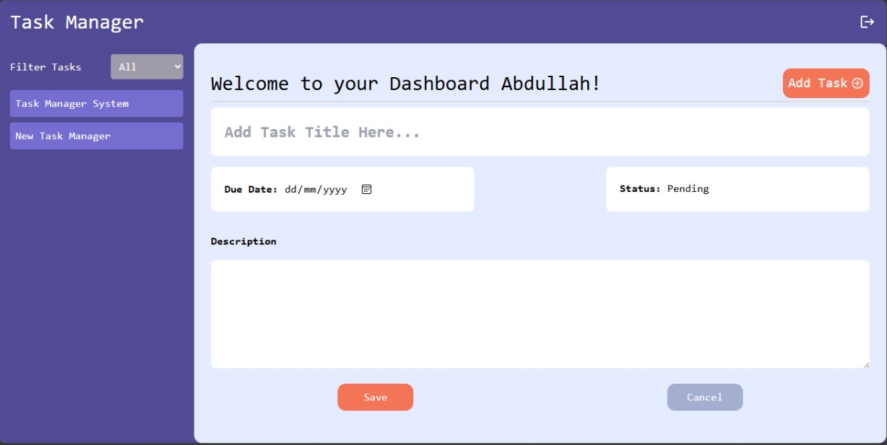
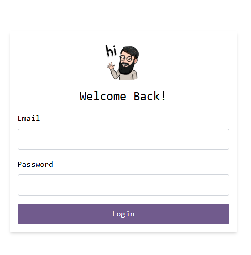

# Task Manager Application

## Overview

The Task Manager Application is a full-stack project designed to enable users to manage tasks efficiently. It provides user authentication and CRUD functionality for tasks. The frontend is built using React, and the backend is powered by Express.js with MongoDB as the database. The application is deployed on Vercel.
#### Link to deployment

```bash
https://task-manager-fe-virid.vercel.app/
```


### Features

- User authentication with JWT.
- CRUD operations for tasks (Create, Read, Update, Delete).
- Responsive and user-friendly interface.
- Secure backend API endpoints.

### Tech Stack

#### Frontend:

- React
- Redux (for state management)
- Axios (for API requests)

#### Backend:

- Node.js
- Express.js
- MongoDB (Database)

#### Deployment:

- Vercel (Frontend and Backend)

---

## Setup Instructions

### Prerequisites

Ensure the following are installed on your system:

- Node.js
- MongoDB
- Git

### Clone the Repository

```bash
git https://github.com/m-abdullah-shakoor/TaskManager.git
cd TaskManager
```

### Backend Setup

1. Navigate to the backend directory (root of the project):
   ```bash
   cd backend
   ```
2. Install dependencies:
   ```bash
   npm install
   ```
3. Create a `.env` file in the root of the backend folder and configure the following:
   ```env
   PORT = 5000
   MONGO_URI = <your-mongodb-connection-string>
   JWT_SECRET = <your-jwt-secret>
   ```
4. Start the backend server:
   ```bash
   node server.js or npm run dev
   ```

### Frontend Setup

1. Navigate to the frontend directory:
   ```bash
   cd frontend
   ```
2. Install dependencies:
   ```bash
   npm install
   ```
3. Start the frontend server:
   ```bash
   npm start
   ```

### Running the Application Locally

1. Ensure both the frontend and backend servers are running.
2. Open your browser and navigate to:
   ```
   http://localhost:3000
   ```

---

## Deployment

### Frontend Deployment on Vercel

1. Push the `frontend` folder to a GitHub repository.
2. In Vercel, import the project from GitHub.
3. set the root directory to `frontend`.
4. And deploy the project.

### Backend Deployment on Vercel

1. Push the `backend` folder to the same GitHub repository.
2. In Vercel, import the project from GitHub.
3. Set the root directory to `backend`.
4. Add environment variables in the Vercel dashboard:
   - `MONGO_URI`
   - `JWT_SECRET`
5. Add a `vercel.json` file in the `backend` directory with the following content for vercel to execute deployment and configure routes:
   ```json
   {
     "version": 2,
     "builds": [
       {
         "src": "server.js",
         "use": "@vercel/node"
       }
     ],
     "routes": [
       {
         "src": "/(.*)",
         "dest": "server.js"
       }
     ]
   }
   ```
6. Deploy the project.

---

## Challenges Encountered

### CORS Issues

Initially, the frontend faced `CORS` errors when making API requests to the backend. This was resolved by configuring the backend server to allow requests from the frontend's deployed URL using `npm cors` package.

### Deployment Configuration

Deploying both the frontend and backend from the same repository required configuring the root directories separately in Vercel. Setting up the correct build and output settings for each deployment was crucial.

---


## Interfaces


---

---